# F-16 Fighting Falcon Simulation
This project aims to visualize the motion of an F-16 Fighting Falcon by adjusting its control surfaces (thrust, rudder, elevator, ailerons) using Unity and MATLAB.

    
[](https://www.youtube.com/watch?v=99ExBoF8pLk)

<video controls src="F-16_SimulationEX.mp4" title="Title"></video>


#### This project is a part of FRA333 Robot Kinematics @ Institute of Field Robotics, King Mongkut’s University of Technology Thonburi

## Table of contents
1. [Overview](#overview)
2. [Getting started](#getting-started)
3. [User guide](#user-guide)
4. [Methodology](#methodology)
    - [F-16 Parameters](#f-16-parameters)
    - [F-16-variables](#f-16-variables)
    - [Constant Variables](#constant-variables)
    - [F-16 Fixed and Free States](#f-16-fixed-and-free-states)
    - [Navigation Equation](#1-navigation-equation)
    - [Kinematic Equation](#2-kinematic-equation)
    - [Force Equation](#3-force-equation)
    - [Moment Equation](#4-moment-equation)
    - [Aerodynamics Equation](#5-aerodynamics)
    - [Force Equation New State](#6-force-equation-new-state)
    - [Linear Velocity Equation](#7-linear-velocity)
    - [Dynamic Pressure Equation](#8-dynamic-pressure)
    - [Coefficient Equation](#9-coefficient)
5. [Validation](#validation)
6. [Conclusion](#conclusion)
7. [Futureplan](#future-plan)
8. [Acknowledgements](#acknowledgements)
9. [References](#references)


## Overview
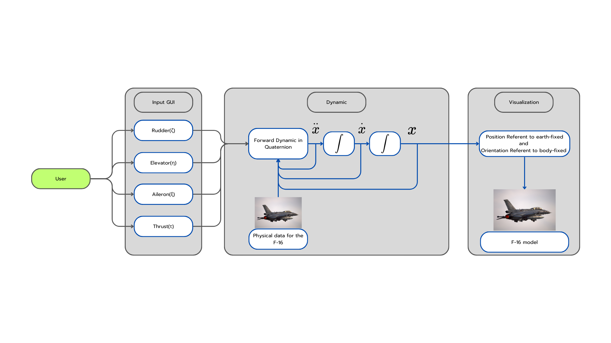

### Feature
- **Simulation :** Simulates the dynamics of the F-16 Fighting Falcon by adjusting its control surfaces.

## Getting started
Compatible only with Windows OS.
### Installation
Clone the repository and install the dependencies:
```bash
git clone https://github.com/boannas/F16_project.git
cd F16_project/Simulation
```
### Open Simulation
```bash
F-16.exe
```
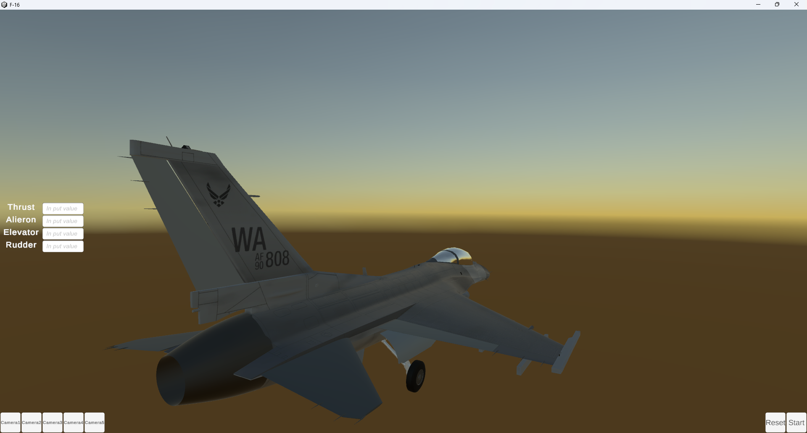

## User guide
You can configure the parameters of the F-16.
- `Ailerons` - Control row axis of airplane. 
- `Elevator` - Control pitch axis of airplane. 
- `Rudder` - Control yaw axis of airplane. 
- `Thrust` - Control X axis of airplane. 

## Methodology
**Control Surfaces**
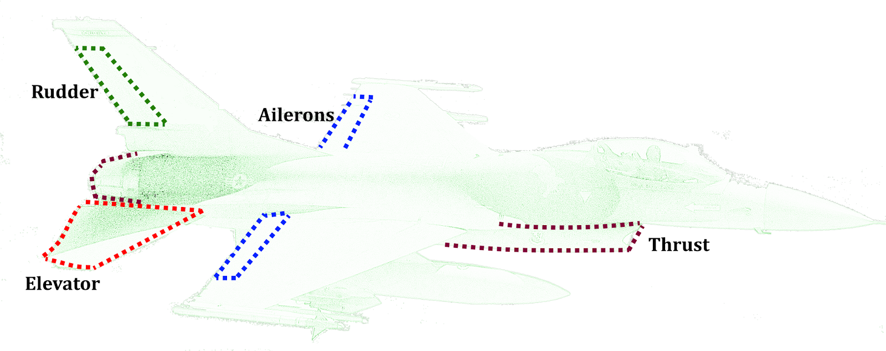
- `Aileron` - Ailerons are primary flight control surface which control movement about the longitudinal axis of an aircraft. This movement is referred to as "roll".
- `Elevator` - The elevator is a primary flight control surface that controls movement about the lateral axis of an aircraft. This movement is referred to as 'pitch'.
- `Rudder` -  "The rudder is a primary flight control surface that controls rotation about the vertical axis of an aircraft. This movement is referred to as 'yaw'.
- `Thrust` - Thrust is the force that moves an aircraft through the air, generated by its engines.


### **F-16 Parameters**
| Parameter    | Description                                          | Value        | Unit       |
|--------------|------------------------------------------------------|--------------|------------|
| 𝑚           | Aircraft mass                                        | 9295.44      | kg         |
| 𝐵           | Wing span                                            | 9.144        | m          |
| 𝑆           | Planform area                                        | 27.87        | m²         |
| c̄           | Mean aerodynamic chord                               | 3.45         | m          |
| 𝑥₍c.g.,r₎    | Reference center of gravity as a fraction of mean aerodynamic chord | 0.35         | -          |
| 𝑥₍c.g.₎      | Center of gravity as a fraction of mean aerodynamic chord | 0.3          | -          |
| 𝐼ₓₓ         | Moment of inertia around \(x\)-axis                  | 12874.847366 | kg·m²      |
| 𝐼ᵧᵧ         | Moment of inertia around \(y\)-axis                  | 75673.623725 | kg·m²      |
| 𝐼𝓏𝓏         | Moment of inertia around \(z\)-axis                  | 85552.113395 | kg·m²      |
| 𝐼ₓ𝓏         | Product moment of inertia between \(x\) and \(z\) axes | 1331.4132386 | kg·m²      |

### **F-16 Variables**
| Variable      | Description                                     | Unit      |
|---------------|-------------------------------------------------|-----------|
| 𝑣ₜ           | Aircraft airspeed in the wind coordinate system | m/s       |
| α             | Angle of attack                                | rad       |
| β             | Side slip angle                                | rad       |
| ϕ, θ, ψ       | Roll, pitch, and yaw angles (Euler angles)      | rad       |
| 𝑃, 𝑄, 𝑅      | Roll, pitch, and yaw angular rates              | rad/s     |
| 𝑈, 𝑉, 𝑊      | Axial linear velocities                        | m/s       |
| 𝑥ₑ, 𝑦ₑ, ℎ = −𝑧ₑ | Position in the earth reference frame         | m         |

### **Constant Variables**
| Constant     | Description                    | Value     | Unit          |
|--------------|--------------------------------|-----------|---------------|
| 𝑔           | Gravitational acceleration     | 9.81      | m/s²          |
| 𝜌           | Air density (at sea level)     | 1.225     | kg/m³         |


### **F-16 Fixed and Free States**

| Fixed Quantities          | Free States/Controls                            |
|---------------------------|------------------------------------------------|
| 𝑉ₜ = 150 m/s            | 𝑥ₑ = 0 m                                    |
| 𝑝 = 0 rad/s              | 𝑦ₑ = 0 m                                    |
| 𝑞 = 0 rad/s              | ℎ = 3000 m                                 |
| 𝑟 = 0 rad/s              | 𝛾 = 0.349                                    |
| ψ = 0 rad/s              | ψ̇ = 0.052 rad/s                              |
| 𝑥₍c.g.₎ = 0.3            | 𝛼, 𝛽, ϕ, θ, δₜₕ, δₑ, δₐ, and δᵣ          |

Note : Fixed quantities are in an inertial state and can be adjusted.

- **δₜₕ**: Throttle angle (Minimum 0.0, Maximum 1.0) 

- **δₑ**: Elevator angle (Minimum -25.0°, Maximum 25.0°)

- **δₐ**: Aileron angle (Minimum -21.5°, Maximum 21.5°)

- **δᵣ**: Rudder angle (Minimum -30.0°, Maximum 30.0°)


#### 1. Navigation Equation
<p align="center">
  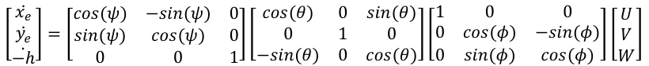
</p>

The transformation of the rotation matrix from the body frame of the F-16 aircraft to the Earth frame can be expressed using roll, pitch, and yaw (Rz Ry Rx).

Where:
- **ẋₑ**: The rate of change of position along the X-axis of the aircraft relative to the Earth frame.
- **ẏₑ**: The rate of change of position along the Y-axis of the aircraft relative to the Earth frame.
- **ż**: The rate of change of position along the Z-axis of the aircraft relative to the Earth frame.

#### 2. Kinematic Equation
<p align="center">
  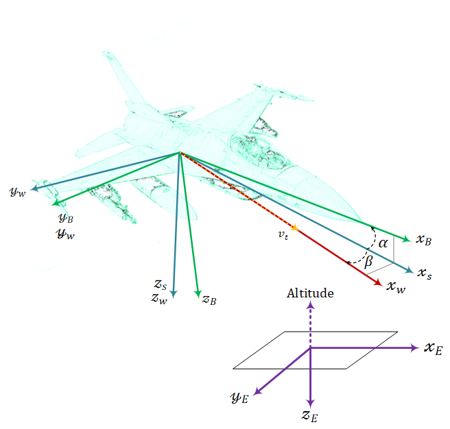
  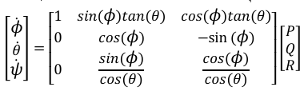
</p>

This equation describes the relationship between angular velocities in the body-fixed frame (P, Q, R) and the rates of change of the Euler angles (ϕ, θ, ψ). **It follows the left-hand rule.**


Where:
- **(ϕ, θ, ψ)**: Roll, Pitch, Yaw (in radians)
- **(P, Q, R)**: Roll, Pitch, Yaw angular rates (in radians per second)


#### 3. Force Equation
<p align="center">
  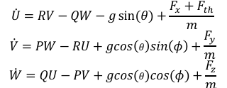
</p>


This equation represents the translational dynamics of a rigid body in a body-fixed coordinate system.

#### 4. Moment Equation
<p align="center">
  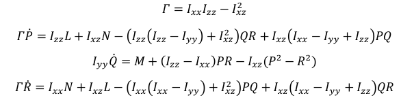
</p>


This set of equations represents the rotational dynamics of a rigid body in terms of its angular momentum and moments of inertia. These equations are derived from Euler's equations of motion for a rigid body.

where:
- **𝐼ₓₓ**: Moment of inertia around the X-axis (kg·m²)
- **𝐼ᵧᵧ**: Moment of inertia around the Y-axis (kg·m²)
- **𝐼𝓏𝓏**: Moment of inertia around the Z-axis (kg·m²)
- **𝑃, 𝑄, 𝑅**: Roll, Pitch, Yaw angular rates (rad/s)
- **𝐿, 𝑀, 𝑁**: External moments (Nm)
- **Γ**: Moments of inertia in the system (kg²·m⁴)

#### 5. Aerodynamics
<p align="center">
  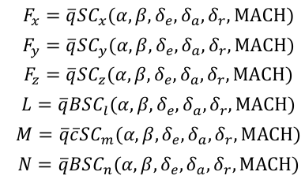
</p>

This set of equations describes the aerodynamic forces(𝐹ₓ,𝐹ᵧ,𝐹𝓏) and moments(L,M,N) acting on a body, such as an aircraft, in terms of aerodynamic coefficients. These forces and moments depend on several parameters like angle of attack(α), sideslip angle(β), control surface deflections(δₑ,δₐ,δᵣ), and the Mach number.

where:
- **q̄**: Dynamic pressure (Pa)
- **S**: Wing reference area (m²)
- **B**: Wingspan (m)
- **c̄**: Mean aerodynamic chord (m)

#### 6. Force equation new state
<p align="center">
  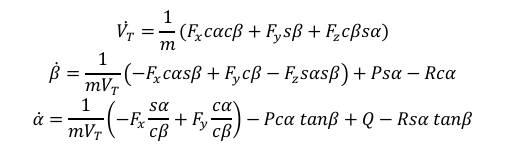
</p>

This set of equations appears to describe the translational and angular dynamics of a body in three dimensions.

where:
- **α**: Angle of attack (alpha) (degree)

- **β**: Sideslip angle (beta) (degree)

- **𝐹ₓ**: Force in the x-axis direction

- **𝐹ᵧ**: Force in the y-axis direction

- **𝐹𝓏**: Force in the z-axis direction


#### 7. Linear velocity  
$$
V_T = \sqrt{U^2 + V^2 + W^2}
$$

$$
\alpha = \tan^{-1}\left(\frac{W}{U}\right)
$$

$$
\beta = \sin^{-1}\left(\frac{V}{V_T}\right)
$$

$$
U = V_T \cos\alpha \cos\beta
$$

$$
V = V_T \sin\beta
$$

$$
W = V_T \sin\alpha \cos\beta
$$

This set of equations defines the relationship between the total velocity(𝑉ₜ) of a moving body and its velocity components in a 3D coordinate system. It also introduces two important aerodynamic angles: angle of attack(α), sideslip angle(β). These equations are widely used in flight mechanics and aerodynamics.

#### 8. Dynamic Pressure 
<p align="center">
𝑞̄ = ½ ρ 𝑉ₜ²
</p>


This equation represents dynamic pressure (q), a key parameter in fluid dynamics and aerodynamic.

where:
- ρ is air density,
- 𝑉ₜ is total velocity.

#### 9. Coefficient 
<p align="center">
  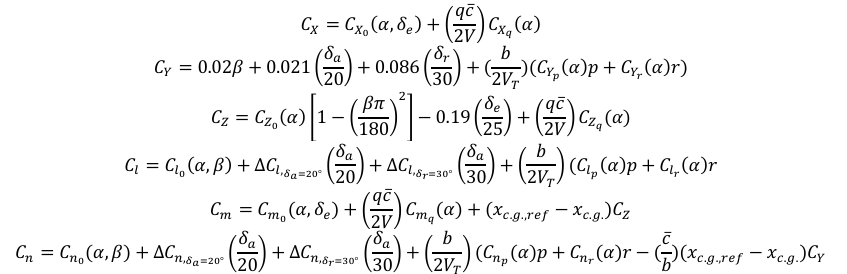
</p>

This set of equations defines the aerodynamic coefficients that determine the aerodynamic forces and moments acting on an aircraft or similar body. These coefficients describe how the aerodynamic forces and moments depend on the angles of attack(α), sideslip angle(β), control surface deflections(δₑ,δₐ,δᵣ), and body rates(p,q,r)

where:
- **𝐶ₓ**: Non-dimensional \(x\)-body-axis force coefficient

- **𝐶ᵧ**: Non-dimensional \(y\)-body-axis force coefficient

- **𝐶𝓏**: Non-dimensional \(z\)-body-axis force coefficient

- **𝐶ₗ**: Lift coefficient

- **𝐶ₘ**: Non-dimensional pitching moment coefficient

- **𝐶ₙ**: Non-dimensional normal force coefficient, \(𝐶ₙ = -𝐶𝓏\)

##### **Coefficient graph from** `Stevens, B. L., Lewis, F. L., & Johnson, E. N. (2016). Aircraft Control and Simulation: Dynamics, Controls Design, and Autonomous Systems (3rd ed.). John Wiley & Sons.`
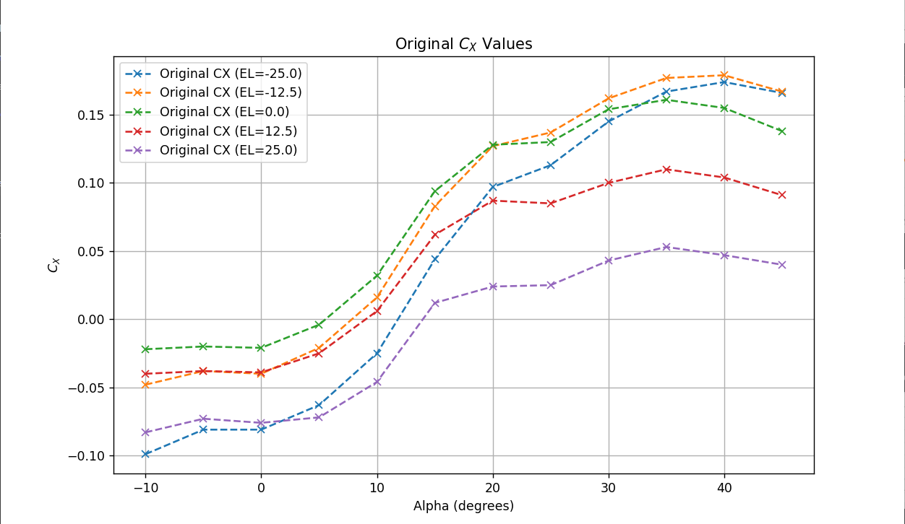
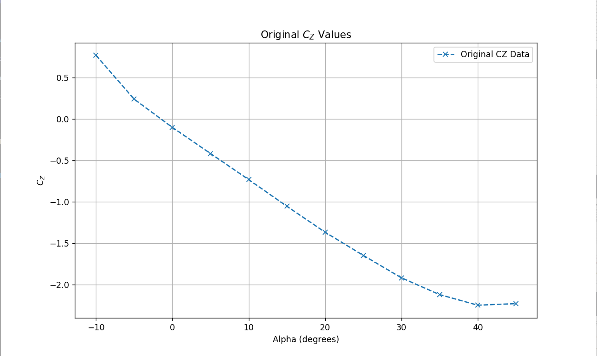
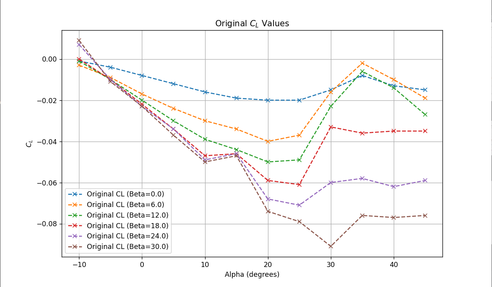
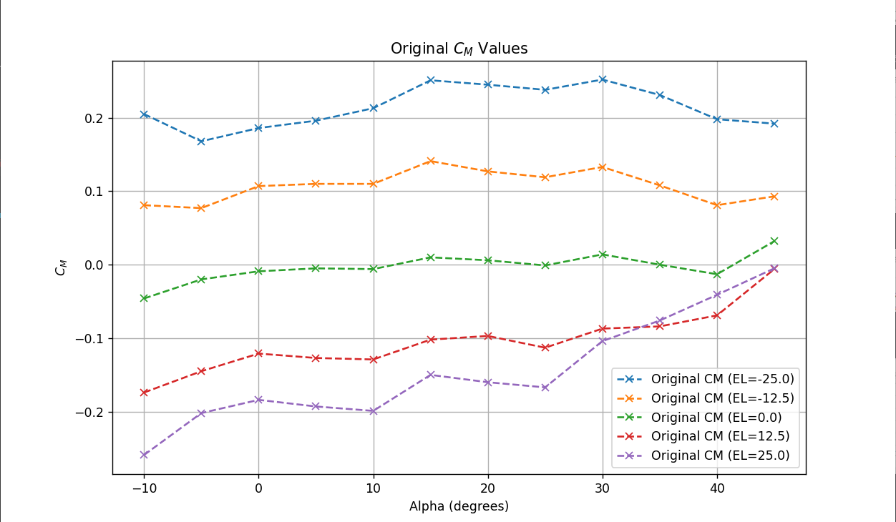
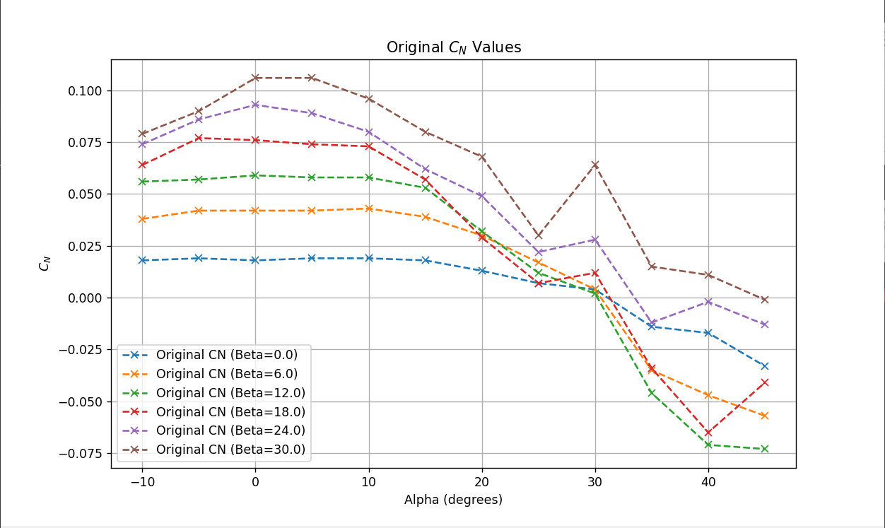

## Validation 

Our F-16 Simulink model
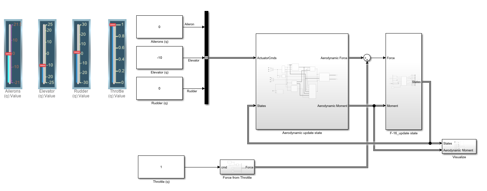

This section outlines the stability validation process for the F-16 under specific control surface configurations. The tests assess the aircraft's stability when all control surfaces are neutral.The next section validates the simulation (**Left**: our comparison, **Right**: Validation from Collimator). 


Alpha comparison
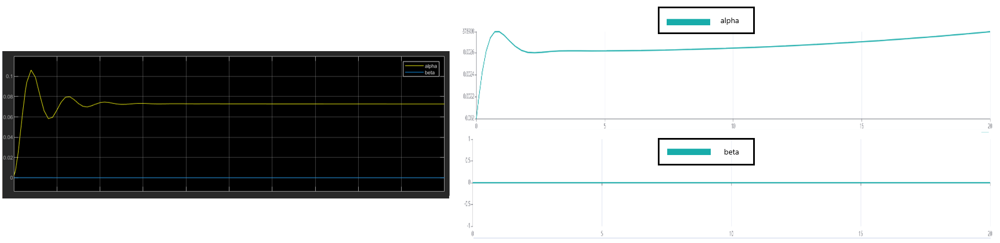

Angular_velocity comparison
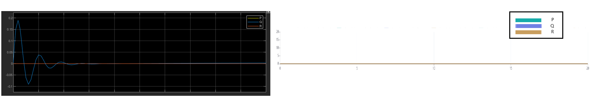

Linear_velocity comparison
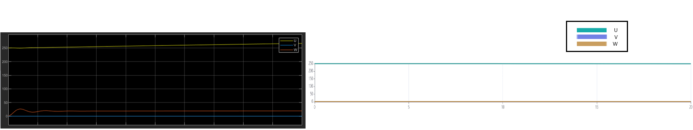

Navigation position comparison
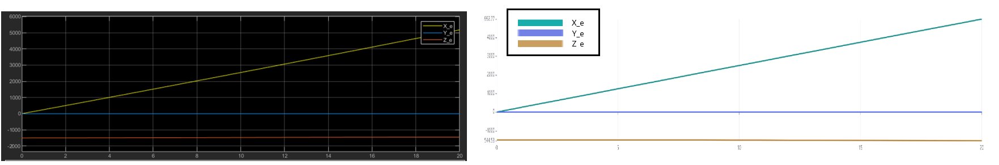

Orientation comparison
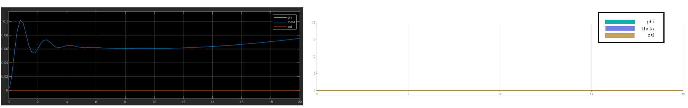

The comparison data closely matches the validation data, with slight discrepancies in oscillation amplitude during the transient phase. The trends and steady-state behaviors align well, indicating the simulation is reasonably accurate. Further refinements could focus on reducing transient oscillations for closer alignment during dynamic changes.

## Conclusion
This project simulates the motion of an F-16 Fighting Falcon using Unity to model its dynamics and visualize the results graphically. Comparisons with MATLAB may reveal differences depending on the simulation methods and parameters used in each system. 

**Currently, the simulation may lack realism due to incomplete aerodynamic equations.**

Users are encouraged to experiment by adjusting the parameters within the Unity simulation.

## Future Plan
- Enhance the graphical user interface (GUI) and visualization.
- Improve equations to enhance realism.

## Acknowledgements
This project is part of the coursework for FRA333 Robot Kinematics at the Institute of Field Robotics, King Mongkut’s University of Technology Thonburi. Special thanks to the course instructors for their guidance and support.

Feel free to explore, modify, and extend this project for educational and research purposes.

## References
- Nguyen, L. T., Ogburn, M. E., Gilbert, W. P., Kibler, K. S., Brown, P. W., & Deal, P. L. (1979). Simulator study of stall/post
stall characteristics of a fighter airplane with relaxed longitudinal static stability (NASA Technical Paper 1538). National 
Aeronautics and Space Administration. Langley Research Center, Hampton, VA. 
- Durham, Wayne. (2013). Aircraft Flight Dynamics and Control. John Wiley & Sons.
- Stevens, B. L., Lewis, F. L., & Johnson, E. N. (2016). Aircraft Control and Simulation: Dynamics, Controls Design, and 
Autonomous Systems (3rd ed.). John Wiley & Sons. 
- STUDYAIRCRAFTS.COM. (N.D.). AIRCRAFT CONTROL SURFACES. STUDY AIRCRAFTS. RETRIEVED FROM 
HTTPS://WWW.STUDYAIRCRAFTS.COM/AIRCRAFT-CONTROL-SURFACES 
- NAE, C., NICOLIN, I., & NICOLIN, B. A. (2022). MILITARY AIRCRAFT FLIGHT CONTROL. IN AERONAUTICS - NEW ADVANCES (PP. 1-14). 
INTECHOPEN. DOI: 10.5772/INTECHOPEN.105491.
- COLLIMATOR.AI. (N.D.). SIMULATING A NONLINEAR F16 MODEL. RETRIEVED FROM 
HTTPS://WWW.COLLIMATOR.AI/TUTORIALS/SIMULATING-A-NONLINEAR-F16-MODEL 
- MICHAEL V. COOK BSC, MSC, CENG, FRAES, CMATH, FIMA (2013). FLIGHT DYNAMICS PRINCIPLES A LINEAR SYSTEMS APPROACH TO 
AIRCRAFT STABILITY AND CONTROL 
- ALLERTON, D., MOIR, I. (SERIES ED.), & OTHERS. (1ST ED.). PRINCIPLES OF FLIGHT SIMULATION. AIAA EDUCATION.
- GABERNET, A. F. (2007). CONTROLLERS FOR SYSTEMS WITH BOUNDED ACTUATORS: MODELING AND CONTROL OF AN F-16 AIRCRAFT 
(MASTER’S THESIS, UNIVERSITY OF CALIFORNIA, IRVINE). 


## Collabulator
- **Napat Aeimwiratchai**
- **Tadtawan Chaloempornmongkol**
- **Asama Wankra**
- **Aittikit Kitcharoennon**
