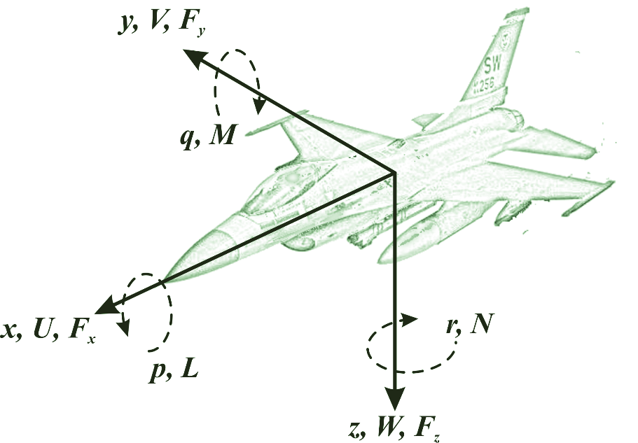

# F16_project
This project simulates the dynamics of a F16 Fighting Falcon
#### This project is a part of FRA333 Robot Kinematics @ Institute of Field Robotics, King Mongkut’s University of Technology Thonburi
เดี๋ยวใส่วิดีโอตรงนี้นะจ้ะ

## Table of contents
1. [Overview](#overview)
2. [Getting started](#getting-started)
3. [User guide](#user-guide)
4. [Methodology](#methodology)
5. [Validation](#validation)
6. [Conclusion](#conclusion)
7. [References](#references)


## Overview

### Feature
- **บินได้มึงก็ใส่มา :** ก็บอกว่าบินได้ไงไอสัสอ่านทำเหี้ยไรอีก
- **บินได้มึงก็ใส่มา :** ก็บอกว่าบินได้ไงไอสัสอ่านทำเหี้ยไรอีก


## Getting started
### Prerequisites
Ensure you have the following dependencies installed:
- `c`
### Installation
Clone the repository and install the dependencies:
```bash
git clone https://github.com/boannas/F16_project.git
cd F16_project
```

## User guide
- `up` - K
- `down` - K
- `left` - K
- `right` - K


## Methodology
**Control Surfaces**

- `Aileron` - Ailerons are a primary flight control surface which control movement about the longitudinal axis of an aircraft. This movement is referred to as "roll".
- `Elevator` - An elevator is a primary flight control surface that controls movement about the lateral axis of an aircraft.This movement is referred to as "pitch".
- `Rudder` -  The rudder is a primary flight control surface which controls rotation about the vertical axis of an aircraft.This movement is referred to as "yaw"
- `Thrust` - Thrust is the force which moves an aircraft through the air. Thrust is generated by the engines of the airplane.


### **F-16 Parameters**
| Parameter    | Description                                          | Value        | Unit       |
|--------------|------------------------------------------------------|--------------|------------|
| 𝑚           | Aircraft mass                                        | 9295.44      | kg         |
| 𝐵           | Wing span                                            | 9.144        | m          |
| 𝑆           | Planform area                                        | 27.87        | m²         |
| c̄           | Mean aerodynamic chord                               | 3.45         | m          |
| 𝑥₍c.g.,r₎    | Reference center of gravity as a fraction of mean aerodynamic chord | 0.35         | -          |
| 𝑥₍c.g.₎      | Center of gravity as a fraction of mean aerodynamic chord | 0.3          | -          |
| 𝐼ₓₓ         | Moment of inertia around \(x\)-axis                  | 12874.847366 | kg·m²      |
| 𝐼ᵧᵧ         | Moment of inertia around \(y\)-axis                  | 75673.623725 | kg·m²      |
| 𝐼𝓏𝓏         | Moment of inertia around \(z\)-axis                  | 85552.113395 | kg·m²      |
| 𝐼ₓ𝓏         | Product moment of inertia between \(x\) and \(z\) axes | 1331.4132386 | kg·m²      |

### **F-16 Variables**
| Variable      | Description                                     | Unit      |
|---------------|-------------------------------------------------|-----------|
| 𝑣ₜ           | Aircraft airspeed in the wind coordinate system | m/s       |
| α             | Angle of attack                                | rad       |
| β             | Side slip angle                                | rad       |
| ϕ, θ, ψ       | Roll, pitch, and yaw angles (Euler angles)      | rad       |
| 𝑃, 𝑄, 𝑅      | Roll, pitch, and yaw angular rates              | rad/s     |
| 𝑈, 𝑉, 𝑊      | Axial linear velocities                        | m/s       |
| 𝑥ₑ, 𝑦ₑ, ℎ = −𝑧ₑ | Position in the earth reference frame         | m         |

### **Constant Variables**
| Constant     | Description                    | Value     | Unit          |
|--------------|--------------------------------|-----------|---------------|
| 𝑔           | Gravitational acceleration     | 9.81      | m/s²          |
| 𝜌           | Air density (at sea level)     | 1.225     | kg/m³         |


### **F-16 Fixed and Free States**
| Fixed Quantities          | Free States/Controls                            |
|---------------------------|------------------------------------------------|
| 𝑉ₜ = 500 ft/s            | 𝑥ₑ = 0 ft                                    |
| 𝑝 = 0 rad/s              | 𝑦ₑ = 0 ft                                    |
| 𝑞 = 0 rad/s              | ℎ = 10,000 ft                                 |
| 𝑟 = 0 rad/s              | 𝛾 = 0.349                                    |
| ψ = 0 rad/s              | ψ̇ = 0.052 rad/s                              |
| 𝑥₍c.g.₎ = 0.3            | 𝛼, 𝛽, ϕ, θ, δₜₕ, δₑ, δₐ, and δᵣ          |

- **δₜₕ**: Throttle angle (องศา)

- **δₑ**: Elevator angle (องศา)

- **δₐ**: Aileron angle (องศา)

- **δᵣ**: Rudder angle (องศา)

| Constant     | Description                    | Value     | Unit          |
|--------------|--------------------------------|-----------|---------------|
| 𝑔           | Gravitational acceleration     | 9.81      | m/s²          |
| 𝜌           | Air density (at sea level)     | 1.225     | kg/m³         |

- `Aileron` - Ailerons are a primary flight control surface which control movement about the longitudinal axis of an aircraft. This movement is referred to as "roll".
- `Elevator` - An elevator is a primary flight control surface that controls movement about the lateral axis of an aircraft.This movement is referred to as "pitch".
- `Rudder` -  The rudder is a primary flight control surface which controls rotation about the vertical axis of an aircraft.This movement is referred to as "yaw"
- `Thrust` - Thrust is the force which moves an aircraft through the air. Thrust is generated by the engines of the airplane.

#### Dynamic Pressure
$$
𝑞̄ = ½ ρ 𝑉ₜ²
$$
where:
- ρ is air density,
- 𝑉ₜ is total velocity.

#### Kinematic Equation
[ ϕ̇ ]   =   [ 1      sin(ϕ)tan(θ)    cos(ϕ)tan(θ) ] [ P ]
[ θ̇ ]       [ 0          cos(ϕ)          -sin(ϕ)  ] [ Q ]
[ ψ̇ ]       [ 0   sin(ϕ)/cos(θ)    cos(ϕ)/cos(θ)  ] [ R ]

Where:
- **(ϕ, θ, ψ)**: Roll, Pitch, Yaw (in radians)
- **(P, Q, R)**: Roll, Pitch, Yaw angular rates (in radians per second)


#### Force Equation
$$
\dot{U} = RV - QW - g\sin(\theta) + \frac{F_x + F_{th}}{m}
$$

$$
\dot{V} = PW - RU + g\cos(\theta)\sin(\phi) + \frac{F_y}{m}
$$

$$
\dot{W} = QU - PV + g\cos(\theta)\cos(\phi) + \frac{F_z}{m}
$$

#### Navigation Equation
$$
\begin{bmatrix}
\dot{x}_e \\\
\dot{y}_e \\\
-\dot{h}
\end{bmatrix}
=
\begin{bmatrix}
\cos(\psi) & -\sin(\psi) & 0 \\\
\sin(\psi) & \cos(\psi) & 0 \\\
0 & 0 & 1
\end{bmatrix}
\begin{bmatrix}
\cos(\theta) & 0 & \sin(\theta) \\\
0 & 1 & 0 \\
-\sin(\theta) & 0 & \cos(\theta)
\end{bmatrix}
\begin{bmatrix}
1 & 0 & 0 \\\
0 & \cos(\phi) & -\sin(\phi) \\
0 & \sin(\phi) & \cos(\phi)
\end{bmatrix}
\begin{bmatrix}
U \\
V \\
W
\end{bmatrix}
$$
Where:
- **ẋₑ**: The rate of change of position along the X-axis of the aircraft relative to the Earth frame.
- **ẏₑ**: The rate of change of position along the Y-axis of the aircraft relative to the Earth frame.
- **ż**: The rate of change of position along the Z-axis of the aircraft relative to the Earth frame.

The transformation of the rotation matrix from the body frame of the F-16 aircraft to the Earth frame can be expressed using roll, pitch, and yaw (Rz Ry Rx).

#### 2. Kinematic Equation

[ ϕ̇ ]   =   [ 1      sin(ϕ)tan(θ)    cos(ϕ)tan(θ) ] [ P ]
[ θ̇ ]       [ 0          cos(ϕ)          -sin(ϕ)  ] [ Q ]
[ ψ̇ ]       [ 0   sin(ϕ)/cos(θ)    cos(ϕ)/cos(θ)  ] [ R ]

Where:
- **(ϕ, θ, ψ)**: Roll, Pitch, Yaw (in radians)
- **(P, Q, R)**: Roll, Pitch, Yaw angular rates (in radians per second)


#### 3. Force Equation
$$
\dot{U} = RV - QW - g\sin(\theta) + \frac{F_x + F_{th}}{m}
$$

$$
\dot{V} = PW - RU + g\cos(\theta)\sin(\phi) + \frac{F_y}{m}
$$

$$
\dot{W} = QU - PV + g\cos(\theta)\cos(\phi) + \frac{F_z}{m}
$$


#### 4. Moment Equation
$$
\Gamma = I_{xx}I_{zz} - I_{xz}^2
$$

$$
\Gamma \dot{P} = I_{zz}L + I_{xz}N - \left[I_{zz}(I_{zz} - I_{yy}) + I_{xz}^2\right]QR + I_{xz}(I_{xx} - I_{yy} + I_{zz})PQ
$$

$$
I_{yy} \dot{Q} = M + (I_{zz} - I_{xx})PR - I_{xz}(P^2 - R^2)
$$

$$
\Gamma \dot{R} = I_{xx}N + I_{xz}L - \left[I_{xx}(I_{xx} - I_{yy}) + I_{xz}^2\right]PQ + I_{xz}(I_{xx} - I_{yy} + I_{zz})QR
$$
where:
- **𝐼ₓₓ**: Moment of inertia around the X-axis (12874.847366 kg·m²)
- **𝐼ᵧᵧ**: Moment of inertia around the Y-axis (75673.623725 kg·m²)
- **𝐼𝓏𝓏**: Moment of inertia around the Z-axis (85552.113395 kg·m²)
- **𝑃, 𝑄, 𝑅**: Roll, Pitch, Yaw angular rates (rad/s)
- **𝐿, 𝑀, 𝑁**: External moments (Nm)
- **Γ**: Moments of inertia in the system (kg²·m⁴)

#### 5. Aerodynamics
$$
F_x = \bar{q}S C_x(\alpha, \beta, \delta_e, \delta_a, \delta_r, \text{MACH})
$$

$$
F_y = \bar{q}S C_y(\alpha, \beta, \delta_e, \delta_a, \delta_r, \text{MACH})
$$

$$
F_z = \bar{q}S C_z(\alpha, \beta, \delta_e, \delta_a, \delta_r, \text{MACH})
$$

$$
L = \bar{q}BS C_l(\alpha, \beta, \delta_e, \delta_a, \delta_r, \text{MACH})
$$

$$
M = \bar{q}cS C_m(\alpha, \beta, \delta_e, \delta_a, \delta_r, \text{MACH})
$$

$$
N = \bar{q}BS C_n(\alpha, \beta, \delta_e, \delta_a, \delta_r, \text{MACH})
$$
where:
- **q̄**: Dynamic pressure (Pa)
- **S**: Wing reference area (m²)
- **B**: Wingspan (m)
- **c̄**: Mean aerodynamic chord (m)

#### 6. Force equation new state
$$
V_Ṫ = \frac{1}{m} \left( F_x \cos\alpha \cos\beta + F_y \sin\beta + F_z \cos\beta \sin\alpha \right)
$$

$$
\dot{\beta} = \frac{1}{mV_T} \left( -F_x \cos\alpha \sin\beta + F_y \cos\beta - F_z \sin\alpha \sin\beta \right) + \frac{1}{V_T} \left( P \sin\alpha - R \cos\alpha \right)
$$

$$
\dot{\alpha} = \frac{1}{mV_T} \left( -F_x \sin\alpha + \frac{F_z \cos\alpha}{\cos\beta} \right) - P \cos\alpha \tan\beta + Q - R \sin\alpha \tan\beta
$$
where:
- **α**: Angle of attack (alpha) (องศา)

- **β**: Sideslip angle (beta) (องศา)

- **𝐹ₓ**: Force in the x-axis direction

- **𝐹ᵧ**: Force in the y-axis direction

- **𝐹𝓏**: Force in the z-axis direction


#### 7. Linear velocity  
$$
V_T = \sqrt{U^2 + V^2 + W^2}
$$

$$
\alpha = \tan^{-1}\left(\frac{W}{U}\right)
$$

$$
\beta = \sin^{-1}\left(\frac{V}{V_T}\right)
$$

$$
U = V_T \cos\alpha \cos\beta
$$

$$
V = V_T \sin\beta
$$

$$
W = V_T \sin\alpha \cos\beta
$$

#### 8. Dynamic Pressure 
$$
𝑞̄ = ½ ρ 𝑉ₜ²
$$
where:
- ρ is air density,
- 𝑉ₜ is total velocity.

#### 9. Coefficient 
$$
C_X = C_{X_0}(\alpha, \delta_e) + \left(\frac{q c}{2V_T}\right) C_{X_q}(\alpha)
$$

$$
C_Y = 0.02\beta + 0.021 \left(\frac{\delta_a}{20}\right) + 0.086 \left(\frac{\delta_r}{30}\right) 
+ \left(\frac{b}{2V_T}\right)\left(C_{Y_p}(\alpha)p + C_{Y_r}(\alpha)r\right)
$$

$$
C_Z = C_{Z_0}(\alpha) \left[1 - \left(\frac{\beta \pi}{180}\right)^2\right] - 0.19\left(\frac{\delta_e}{25}\right) + \left(\frac{q c}{2V_T}\right) C_{Z_q}(\alpha)
$$

$$
C_l = C_{l_0}(\alpha, \beta) + \Delta C_{l_{\delta_a=20}} \left(\frac{\delta_a}{20}\right) + \Delta C_{l_{\delta_r=30}} \left(\frac{\delta_r}{30}\right)
+ \left(\frac{b}{2V_T}\right)\left(C_{l_p}(\alpha)p + C_{l_r}(\alpha)r\right)
$$

$$
C_m = C_{m_0}(\alpha, \delta_e) + \left(\frac{q c}{2V_T}\right) C_{m_q}(\alpha) + (x_{c.g.,ref} - x_{c.g.})C_Z
$$

$$
C_n = C_{n_0}(\alpha, \beta) + \Delta C_{n_{\delta_a=20}} \left(\frac{\delta_a}{20}\right) + \Delta C_{n_{\delta_r=30}} \left(\frac{\delta_r}{30}\right)
+ \left(\frac{b}{2V_T}\right)\left(C_{n_p}(\alpha)p + C_{n_r}(\alpha)r\right) - \frac{\bar{C}_D}{b}(x_{c.g.,ref} - x_{c.g.})C_Y
$$
where:
- **𝐶ₓ**: Non-dimensional \(x\)-body-axis force coefficient

- **𝐶ᵧ**: Non-dimensional \(y\)-body-axis force coefficient

- **𝐶𝓏**: Non-dimensional \(z\)-body-axis force coefficient

- **𝐶ₗ**: Lift coefficient

- **𝐶ₘ**: Non-dimensional pitching moment coefficient

- **𝐶ₙ**: Non-dimensional normal force coefficient, \(𝐶ₙ = -𝐶𝓏\)

##### **Coefficient graph from** `Stevens, B. L., Lewis, F. L., & Johnson, E. N. (2016). Aircraft Control and Simulation: Dynamics, Controls Design, and Autonomous Systems (3rd ed.). John Wiley & Sons.`


## Validation 
This section outlines the stability validation process for the F-16 under specific control surface configurations. The tests assess the aircraft's stability when all control surfaces are neutral and when each orientation is tested independently along each axis.

## 1. Stability with Neutral Control Surfaces
- **Objective**: Verify the aircraft's inherent stability when all control surfaces are set to zero.
- **Test Conditions**:
  - **δₜₕ (Throttle)**: 0.5 (50% thrust for steady flight)
  - **δₐ (Aileron)**: 0°
  - **δₑ (Elevator)**: 0°
  - **δᵣ (Rudder)**: 0°
- **Expected Outcome**:
  - The aircraft should maintain steady, level flight without external disturbances.
  - Minimal oscillations or divergence from the current orientation.

## 2. Stability Test: Orientation Along Each Axis
- **Objective**: Assess the stability response when control inputs are applied along each axis individually.

### 2.1 Roll Stability (Aileron Input)
- **Test Conditions**:
  - **δₜₕ (Throttle)**: 0.5
  - **δₐ (Aileron)**: ±21.5° (maximum deflection, alternating directions)
  - **δₑ (Elevator)**: 0°
  - **δᵣ (Rudder)**: 0°
- **Expected Outcome**:
  - The aircraft should exhibit roll response proportional to the input.
  - Upon returning δₐ to 0°, the aircraft should stabilize and return to level flight.

### 2.2 Pitch Stability (Elevator Input)
- **Test Conditions**:
  - **δₜₕ (Throttle)**: 0.5
  - **δₐ (Aileron)**: 0°
  - **δₑ (Elevator)**: ±30° (maximum deflection, alternating directions)
  - **δᵣ (Rudder)**: 0°
- **Expected Outcome**:
  - The aircraft should pitch up or down based on the elevator input.
  - Upon returning δₑ to 0°, the aircraft should stabilize to a steady state.

### 2.3 Yaw Stability (Rudder Input)
- **Test Conditions**:
  - **δₜₕ (Throttle)**: 0.5
  - **δₐ (Aileron)**: 0°
  - **δₑ (Elevator)**: 0°
  - **δᵣ (Rudder)**: ±25° (maximum deflection, alternating directions)
- **Expected Outcome**:
  - The aircraft should yaw to the right or left based on rudder input.
  - Upon returning δᵣ to 0°, the aircraft should stabilize without significant oscillations.

### 3. Tee lung ka Stability (Integrate 3 orientation axis)
- ** Test Conditions**:
  - **δₜₕ (Throttle)**: 0.5
  - **δₐ (Aileron)**: ±0°
  - **δₑ (Elevator)**: ±0°
  - **δᵣ (Rudder)**: ±0° 
- **Expected Outcome**:
  - The aircraft should "Tee lung ka" when apply Throttle, Aileron, Elevator, Rudder.
  - Upon returning δₐ, δₑ, δᵣ to 0°, the aircraft should stabilize without significant oscillations.

## Conclusion

Summarize why Out doesn't look like validate graph ==== Aerodynamics !!!


## References
- [NASA](www.pornhub.com)


## Collabulator
- **Napat Aiamwiratchai**
- **Tadtawan Chaloempornmongkol**
- **Asama Wankra**
- **Aittikit**